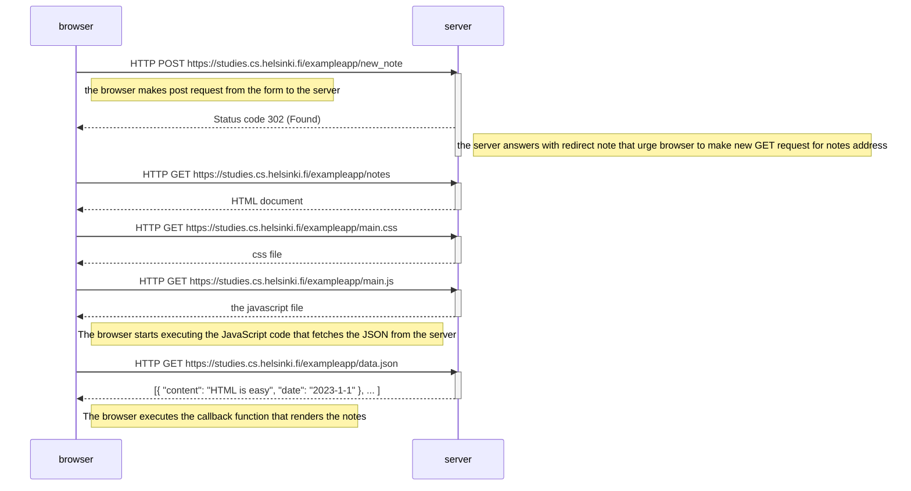
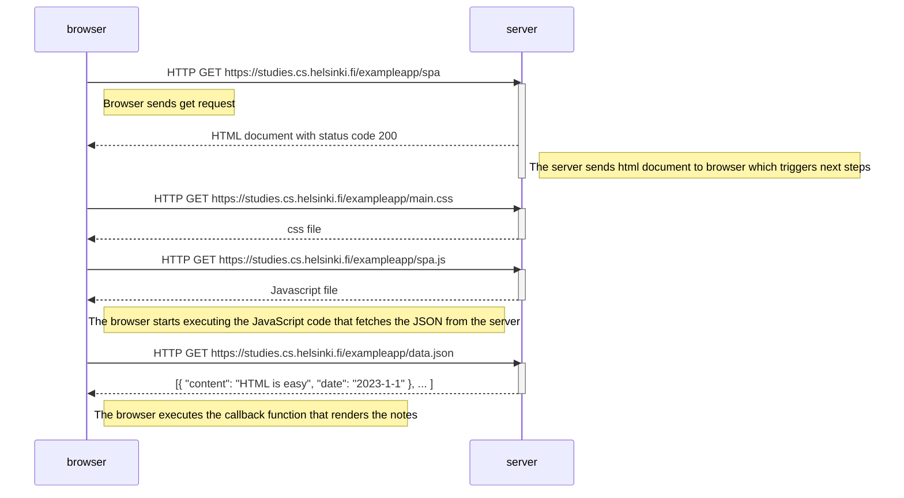
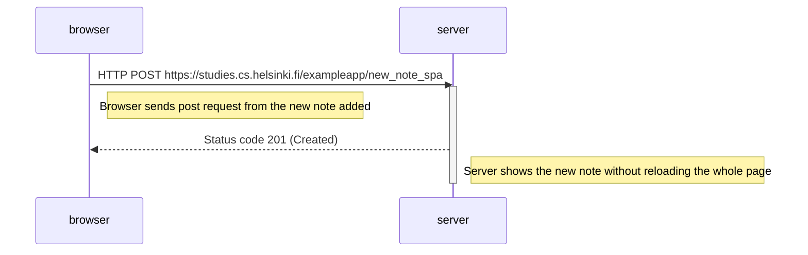

Viikko 0

Tehtävät

Osa 0.1 - Luettu 18.9.2024.

Osa 0.2 - Luettu 18.9.2024.

Osa 0.3 - Luettu 18.9.2024

Osa 0.4

```mermaid
sequenceDiagram
participant browser
participant server
browser->>server: HTTP POST https://studies.cs.helsinki.fi/exampleapp/new_note
activate server
Note right of browser: the browser makes post request from the form to the server
server-->>browser: Status code 302 (Found)
Note right of server: the server answers with redirect note that urge browser to make new GET request for notes address
deactivate server
browser->>server: HTTP GET https://studies.cs.helsinki.fi/exampleapp/notes
activate server
server-->>browser: HTML document
deactivate server
browser->>server: HTTP GET https://studies.cs.helsinki.fi/exampleapp/main.css
activate server
server-->>browser: css file
deactivate server
browser->>server: HTTP GET https://studies.cs.helsinki.fi/exampleapp/main.js
activate server
server-->>browser: the javascript file 
deactivate server
Note right of browser: The browser starts executing the JavaScript code that fetches the JSON from the server
browser->>server: HTTP GET https://studies.cs.helsinki.fi/exampleapp/data.json
activate server
server-->>browser: [{ "content": "HTML is easy", "date": "2023-1-1" }, ... ]
deactivate server
Note right of browser: The browser executes the callback function that renders the notes
```    

Osa 0.5

```mermaid
sequenceDiagram
participant browser
participant server
browser->>server: HTTP GET https://studies.cs.helsinki.fi/exampleapp/spa
activate server
Note right of browser: Browser sends get request
server-->>browser: HTML document with status code 200
Note right of server: The server sends html document to browser which triggers next steps
deactivate server
browser->>server: HTTP GET https://studies.cs.helsinki.fi/exampleapp/main.css
activate server
server-->>browser: css file
deactivate server
browser->>server: HTTP GET https://studies.cs.helsinki.fi/exampleapp/spa.js
activate server
server-->>browser: Javascript file
deactivate server
Note right of browser: The browser starts executing the JavaScript code that fetches the JSON from the server
browser->>server: HTTP GET https://studies.cs.helsinki.fi/exampleapp/data.json
activate server
server-->>browser: [{ "content": "HTML is easy", "date": "2023-1-1" }, ... ]
deactivate server
Note right of browser: The browser executes the callback function that renders the notes
```

Osa 0.6

```mermaid
sequenceDiagram
participant browser
participant server
browser->>server: HTTP POST https://studies.cs.helsinki.fi/exampleapp/new_note_spa
activate server
Note right of browser: Browser sends post request from the new note added
server-->>browser: Status code 201 (Created)
Note right of server: Server shows the new note without reloading the whole page
deactivate server
```

